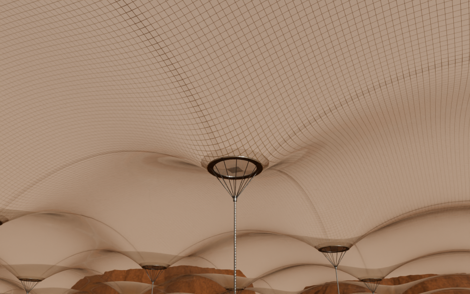
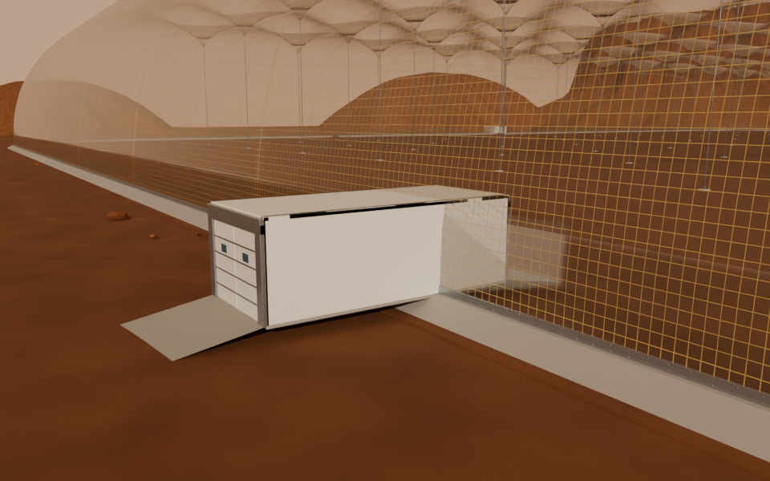
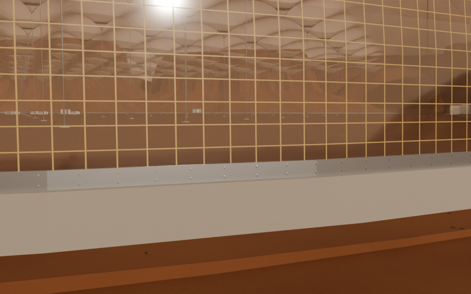
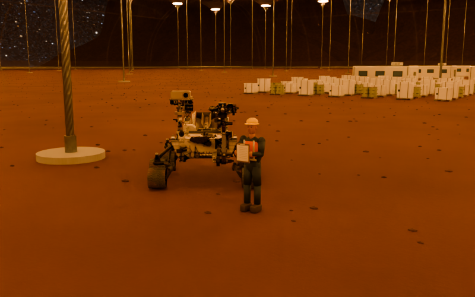
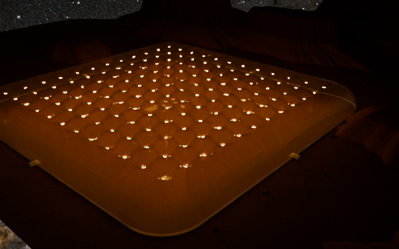
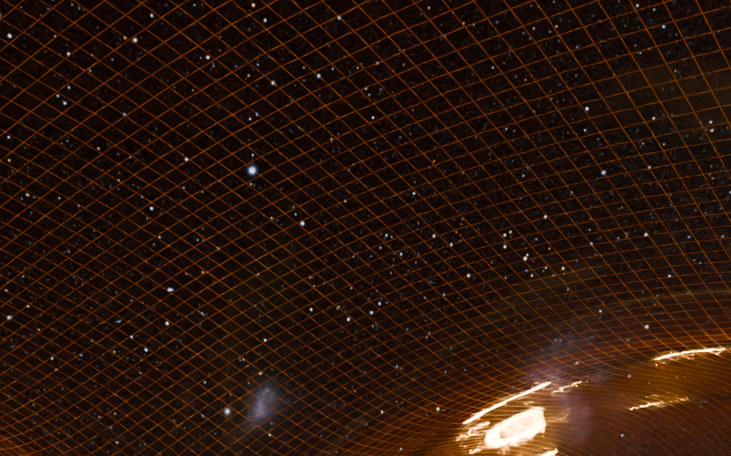
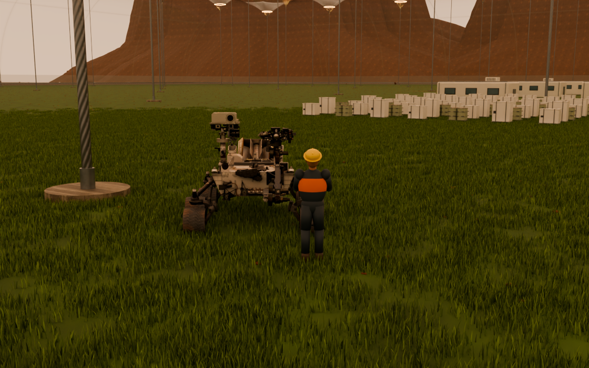
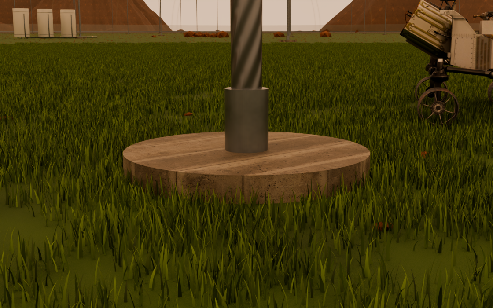
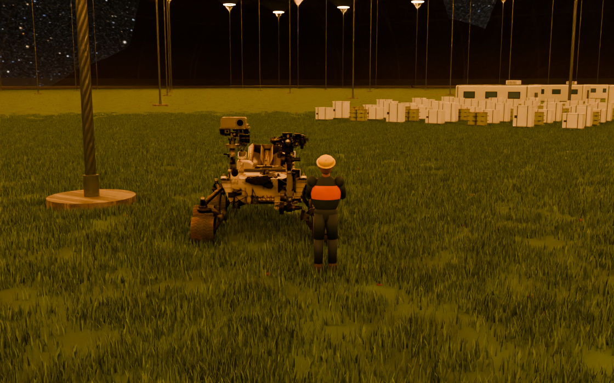

# Mars Tensile Vault

An editable Blender study of a Mars habitat inspired by Casey Handmer's tensile-vault concept: pressure-derived membrane bays, cable anchors, continuous perimeter clamps, vehicle airlocks, regolith terrain, and a supply yard with Curiosity.



## Open the scene

Download this repository and open **mars-tensile-vault.blend** in **Blender 5.2 LTS or newer**. All model data and image textures are included in the blend file. No add-on, external asset download, or startup script is required.

The portable file defaults to CPU rendering so it opens on machines without a compatible GPU. Select a GPU in Blender's Cycles preferences, or use the included renderer, which tries supported GPU backends and falls back to CPU:

```sh
blender --background --disable-autoexec mars-tensile-vault.blend --python tools/render.py
```

## What is editable?

- Anchor counts, spacing, cable and ring dimensions on **TENSILE CAGE**.
- Pressure-derived roof height, film and reinforcement appearance.
- Continuous sloped concrete footing and paired clamping plates.
- Vehicle airlocks: **18 m long, 8 m wide, 6 m high**, with **6.5 m × 5 m hatches** and 6 m access ramps at the default settings.
- A night-sky toggle, saved off, with separately controlled ring LEDs.

See [the controls guide](docs/CONTROLS.md) and [asset credits](ASSET-CREDITS.md).




This is a visualization, not a validated habitat structure. The roof reuses a saved pressure-simulation shape; layout edits do not run a new engineering analysis. Airlocks are closed visual assemblies; their membrane penetrations, gaskets, mechanisms and operational sequencing are schematic.

The scene contains third-party and owner-supplied assets. See the credits for provenance and applicable reuse information; this repository does not apply a blanket license to all included assets.

## Night previews

The share file includes a packed catalogue star map oriented for Gale Crater, separate day/night exposure, and explicitly sampled ring emitters. See [night controls and sky assumptions](docs/CONTROLS.md#night-rendering).





## Grass and surface update

Toggle **Grass field** on **SURFACES • grass and lighting controls**. The file includes shared grass-blade instances with camera-distance detail, packed concrete/soil texture maps, transparent modeling-preview film, and 160-degree downward LED beams with faint all-angle glow. See [surface controls](docs/CONTROLS.md#grass-surface-relief-and-wide-ring-lighting).





The realistic person replacement is pending a blocked asset download; the original figure remains as a temporary scale reference.
