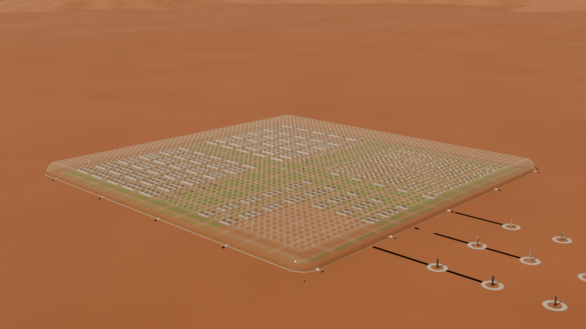

# Mars Tensile Vault — year 15

An editable Blender concept of a 50 × 50-column Mars settlement at 50 m spacing, in an open valley surrounded by distant mesas. The original pressure-derived membrane and perimeter remain live; the year-15 masterplan adds homes, factory halls, utilities, freight, and landed Starships.

## Open and render

Open **mars-tensile-vault.blend** in **Blender 5.2 LTS or newer**. Textures and source meshes are packed. No add-on or script auto-execution is required for ordinary use. The file is saved for Cycles GPU rendering; select a compatible device in Preferences, or use `tools/render.py` for automatic GPU selection with CPU fallback.

- **Frame 1:** afternoon, 15:00.
- **Frame 120:** night, 22:00; settlement lights turn on automatically.
- Select **SETTLEMENT • time and district controls** and use Object Properties → Custom Properties for solar hour, exposures, lamp brightness, temperature, L/W stride and phase, checkerboard lighting, district toggles, grass detail, and exterior haze.
- Choose cameras **01–09** for the valley, civic park, homes, industry, cargo, landing field, and distant exterior view.

## Scene contents

The rings are 75 m above grade. Three approximately 50 m Starships are preserved inside, with eight crew/cargo ships on exterior pads east of the enclosure. The freight quarter is on that same side, with truck aisles connected to the actual vehicle-airlock positions. Thermal tiles retain their dark material; stainless steel uses a separate procedural finish.

The native cage still supports column count, spacing, height and ring/cable edits. **The district layout, grass footprint, roads and terrain are an editable masterplan for this 50 × 50 configuration; they do not automatically regenerate after changing the cage footprint.**

Grass uses a continuous textured surface plus three tiers of shared blade instances. The default detail distances are 150 m, 600 m and 3,500 m. Concrete, regolith and cable materials use procedural relief and roughness. The exterior atmosphere excludes a clear prism around the habitat. The valley is now about five times wider, with 360° mesas/mountains and a 1,000 km ground extent, so the saved views have no exposed ground edge.

The night preset uses 3×3 ring spacing, matched sampled lights, visible airlock apron fixtures, and an adjustable artistic moonlight boost. See the controls guide for the faint reference setting.

See [current controls](docs/YEAR15-CONTROLS.md), [original membrane controls](docs/CONTROLS.md), and [asset credits](ASSET-CREDITS.md). Setup/migration scripts are historical one-time operations; do not rerun them on the completed scene. The render scripts are repeatable.

This is an architectural visualization, not a validated pressure structure or landing-site design. The membrane reuses an accepted Cloth-derived shape, not a new structural solve. Building designs, vehicle airlocks, landing clearances and industrial systems are schematic. Time of day is an art-direction control, not an astronomical ephemeris or absolute radiometric calibration.
