# Mars Tensile Vault — year 15

Based off of https://caseyhandmer.wordpress.com/2019/11/28/domes-are-very-over-rated/ and other discussions I've had on X.
I've been working on this off and on for the past week or so, it's mostly parametric, though you may need to use an LLM to adjust things if they break, sorry! This was done with a mix of Astra and Fable 5.5, both were quite capable of making up for my lack of blender experience.


I've noticed I'm overly polishing this, & putting off posting it, so I will add an addendum that there's a bunch of geometry and misc stuff that doesn't make sense, buildings should be pressure rated, there should be bulkheads, solar is silly, claude didn't really get what I meant by substation (mars is gonna be almost entirely DC I reckon). Oh also cursory math was done but connection hardware, tensile wires, film thickness etc are ballpark, I took some artistic liberties, probably needs to be thicker.


It does look pretty darn cool though. I spent a good amount of time tweaking the ETFE. When the ceiling was lower I had some solar powered LED ring lights, which might make sense for work areas, though serviceability & materials use makes it silly on a practical level, better those cells were in the main array & everyone just carry lights around/job lights. 


The design is tileable so it should adapt well to most flat terrain and any scale. Have fun!


Claude: 

An editable Blender concept of a Mars settlement under a tensile vault, after Casey Handmer's proposal: a Kevlar-reinforced ETFE membrane held down by a 50 × 50 grid of cable anchors at 50 m spacing, with the roof rings 200 m above the ground. The year-15 masterplan inside adds detailed homes, residential towers, factory halls, a stacked freight yard, a battery substation, thousands of residents and landed Starships. Outside, a 34 km² solar farm powers it, in a rock-strewn valley surrounded by distant mesas.

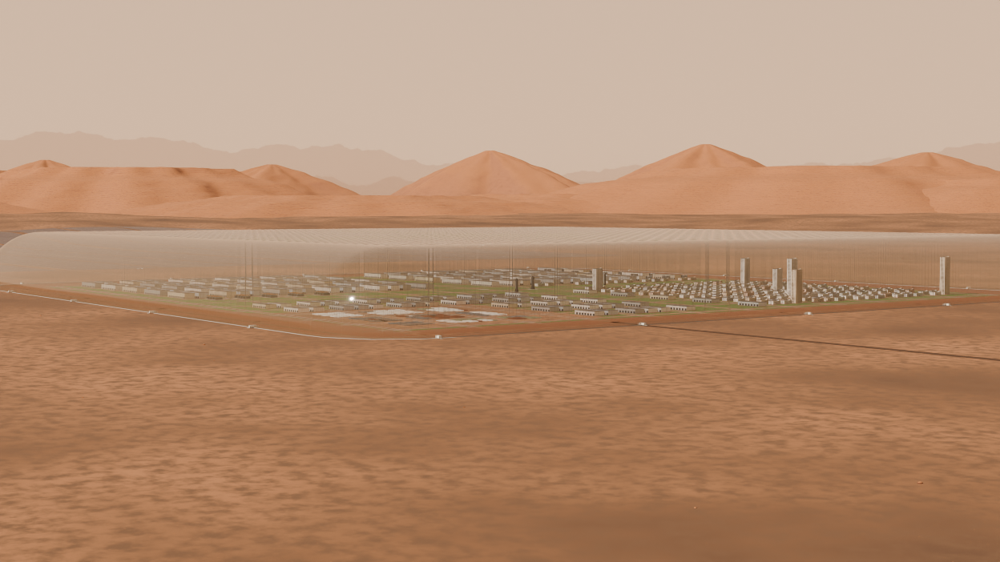

## Quick start

1. Open **mars-tensile-vault.blend** in **Blender 5.2 LTS or newer**. Keep the `assets/sky` folder beside it (the night-sky EXRs are external files); clone or download the whole repository. No script auto-execution is needed.
2. **CONTROLS • Mars vault** is already selected. The **Modifier tab** (wrench) shows every scene control in collapsible sections.
3. **Tick `Night` for night, untick it for day.** That one checkbox switches the sky, Sun, exposure, ring LEDs, apron floods and lit windows. The timeline plays no part.
4. Pick camera **01–13** and render (F12). The file is set up for Cycles GPU; choose your device in Preferences, or run `tools/render.py`. Expect several minutes per 1080p frame on a mid-range GPU (about 6 minutes on an RX 5700 XT at the saved 128 samples). The first ~40 s is scene preparation, not a hang. Switch the viewport out of Rendered mode before pressing F12 so the GPU isn't holding two copies of the scene. If your GPU driver is unstable under long renders, set Render → Device to CPU. An 8-core Ryzen renders the 65% README previews in about 3 minutes each, and the scene fits comfortably in 32 GB of RAM.

| Section | Holds |
|---|---|
| Time of day | **Night**, day solar hour, sun and sky strength, day and night exposure |
| Sky and atmosphere | Mars blue aureole, skybox mountains, stars, Milky Way, exterior haze, dust storm |
| Moon (Phobos) | Fill light, presentation boost, position, disk |
| Habitat lights (night) | LED glow and power, colour temperature, which rings are lit, beam, airlock floods |
| Districts | Homes, warehouses, industry, cargo yard, Starships, grass, people, rock field, solar farm and power |
| Grass detail | Distance LOD and density |
| Membrane optics | ETFE film IOR, haze, reflections, Kevlar translucency |
| Viewport performance | Coarse anchors in the viewport (renders keep full detail) |

Structure is edited on two geometry objects, also in the Modifier tab: **TENSILE CAGE** (grid, spacing, height, anchors, cables) and **MEMBRANE** (concrete pad, clamps, Kevlar, airlocks). They are kept apart from the look controls because re-evaluating the membrane takes a few seconds.

Full details are in **[docs/CONTROLS.md](docs/CONTROLS.md)**.

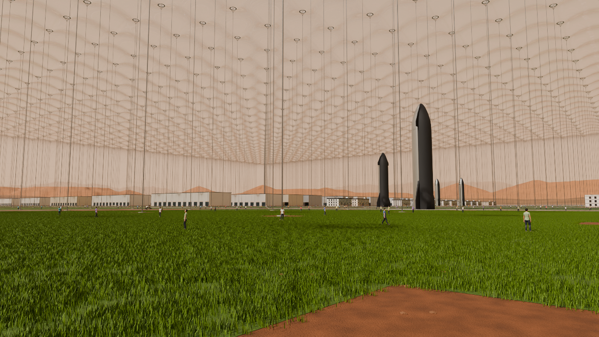
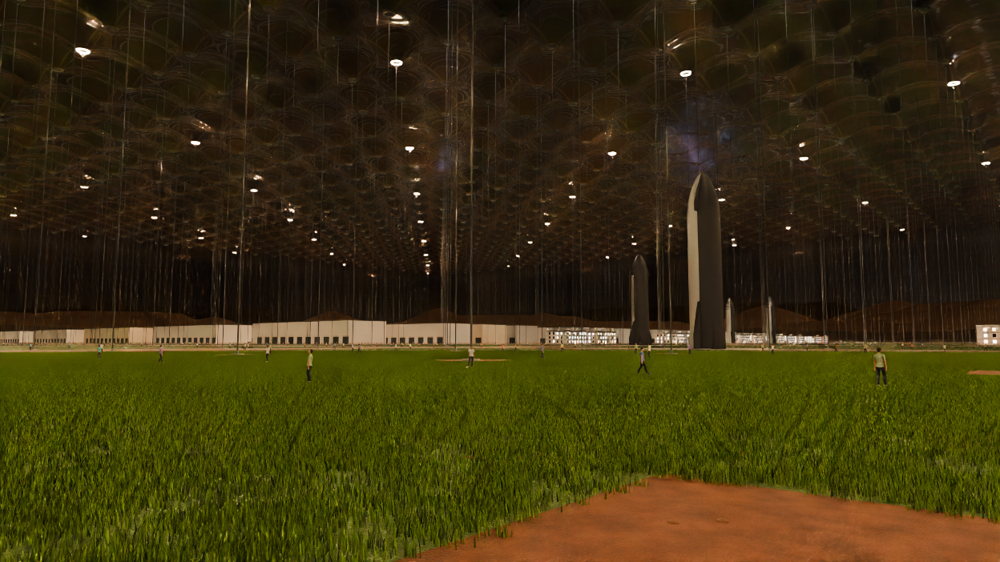

## What's in the scene

- **Membrane:** a smoothed Cloth pressure result cut to a 50 m bay and repeated. Its welded panels, four-ply collars around the ring inserts and Kevlar reinforcement all follow the live cage. It is a reusable pressure-derived shape, not a new structural solve for each edit.
- **Wall welds:** the wall is tiled from welded panels. Horizontal welds run continuously round the corners, and the corner's vertical welds fan radially from the corner anchor, so every reinforcement line tees into an anchor. Corner panels taper towards the top.
- **Perimeter:** a continuous concrete pad and double clamping plates with bolt rows, following the rounded corners, plus 18 × 8 × 6 m vehicle airlocks.
- **Buildings:** three-storey homes with recessed, framed windows, precast panel facades in varied tints, floor bands, glass balconies, entrance canopies and rooftop PV and plant. Six residential towers of 24–38 storeys (82–130 m) use the same generator. Factory halls have ribbed metal cladding. At night, windows light up at random with warm or cool interiors.
- **Settlement:** factory halls, tanks, three heritage Starships inside, and eight crew/cargo ships on pads 2 km east, reached by a compacted-regolith road.
- **Freight yard:** forklift-spaced pallet blocks stacked 2–4 high: wrapped equipment, drums, rolled steel plate, pipe bundles, bulk bags, sintered-regolith bricks and aluminium ingots, with forklifts in the aisles.
- **People:** about 8,000 residents and workers standing, walking or looking up at the roof, on walkways, streets and park turf. They are static poses of the embedded rigged figure, with varied clothing and skin.
- **Power:** a 5.8 km square solar farm to the west, made of low east/west tent rows laid on the terrain, with access tracks and inverter skids (collectors assumed buried). It feeds a substation on the farm edge. A surface-laid HV cable on sleepers runs to a duct vault at the west wall, then underground to a battery substation inside the dome, under the sloping west wall.
- **Grass:** shared blade instances in three distance tiers that fade to a textured turf surface, never realised.
- **Sky:** a butterscotch day sky with a faint blue aureole around the Sun (as seen from Mars) and hazy procedural ranges on the far horizon. The night sky is NASA's 16k star catalogue, oriented for Gale Crater, with the Milky Way.
- **Landscape:** procedural Mars ground (dust and basalt-sand patches, wind ripples, gravel) with about a million real rock instances outside the walls, stratified mesas 26–42 km away, a mountain chain at 68–98 km and 1,000 km of ground.

**The cage is parametric, but the masterplan is fixed to the 50 × 50 footprint:** districts, roads, grass masks and fixtures do not regenerate when the cage is resized.

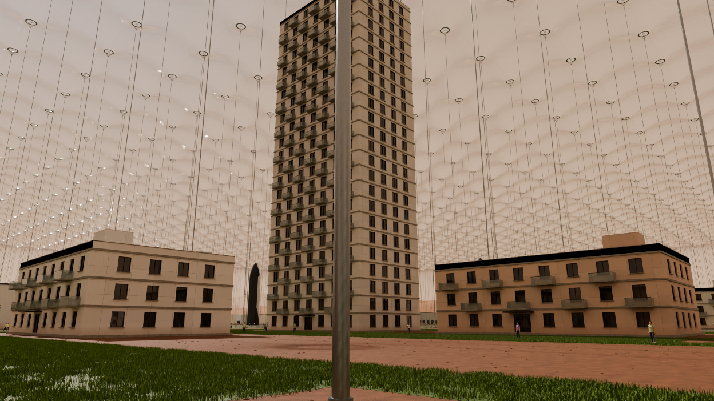
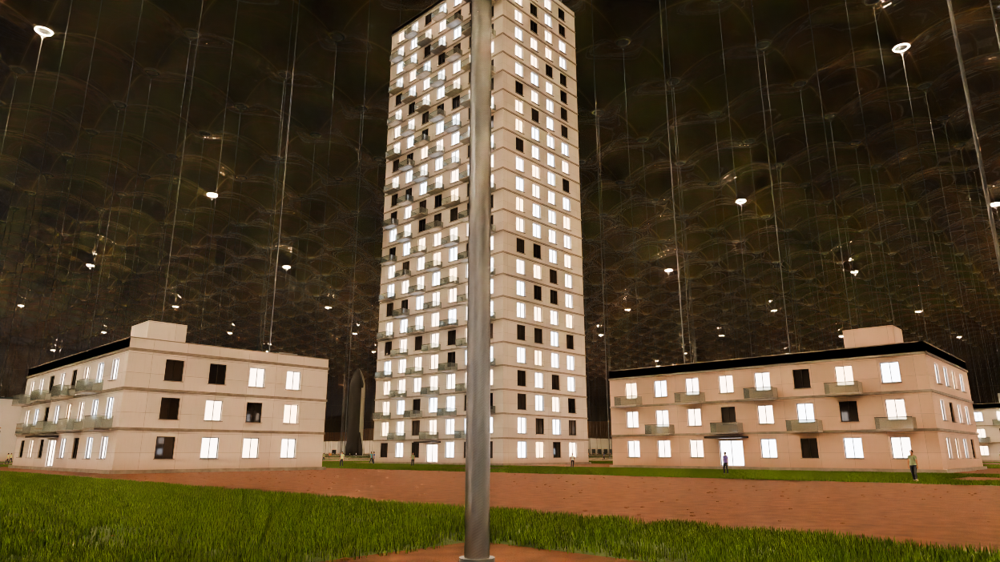
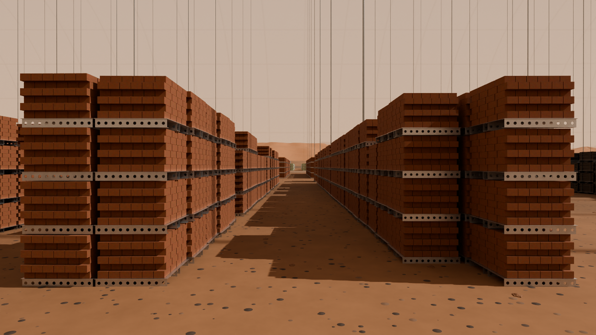
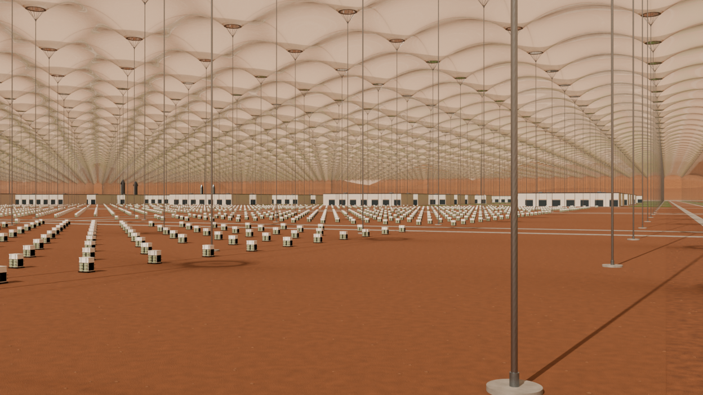
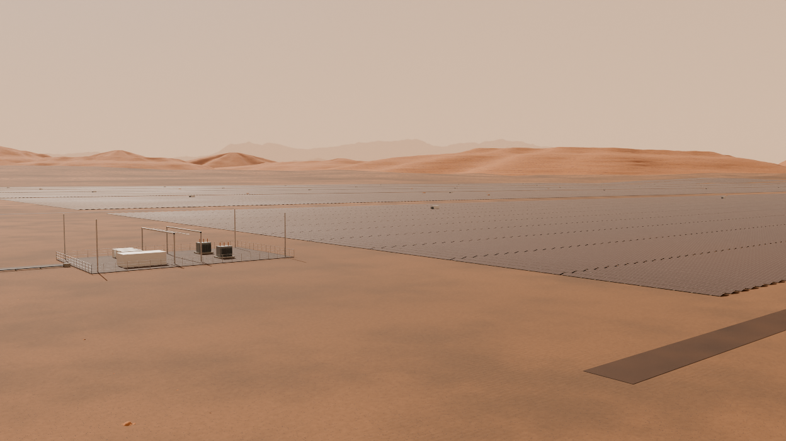
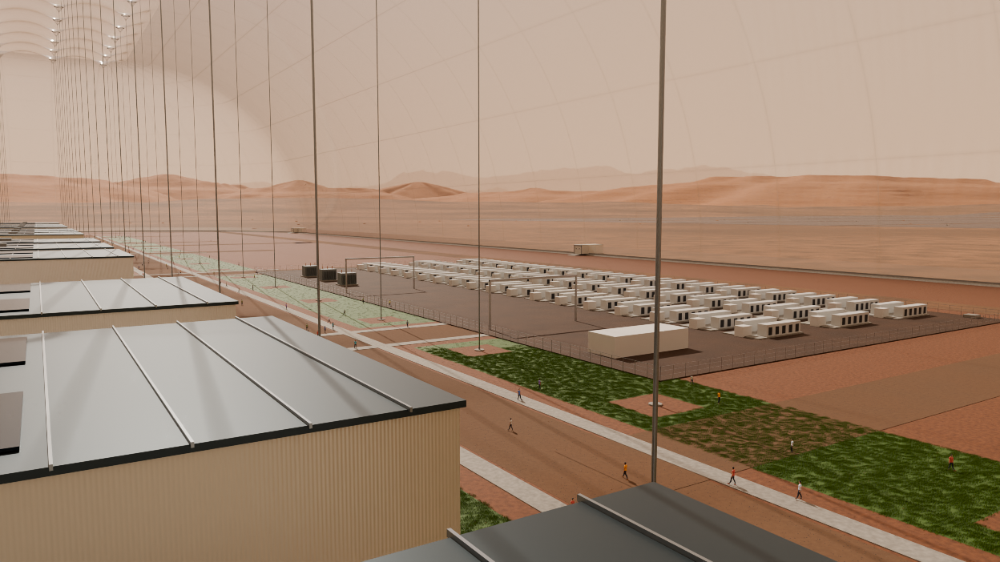
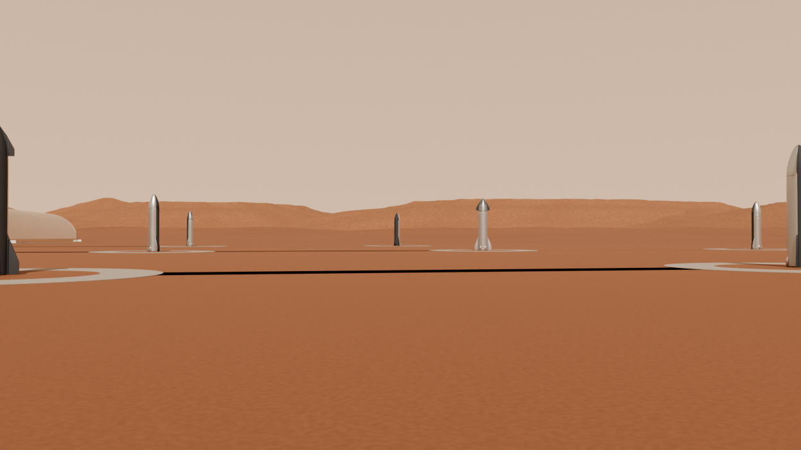
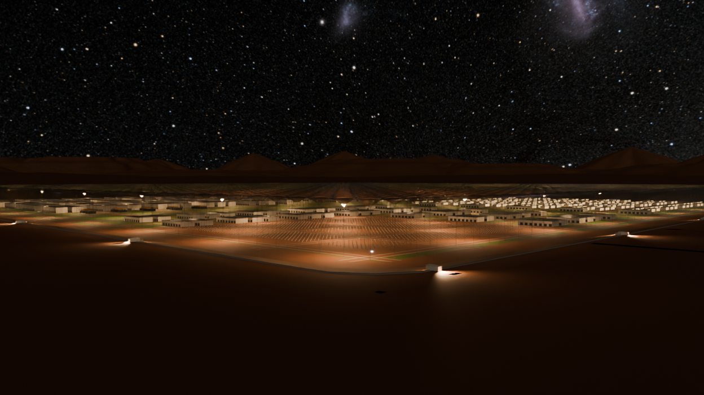
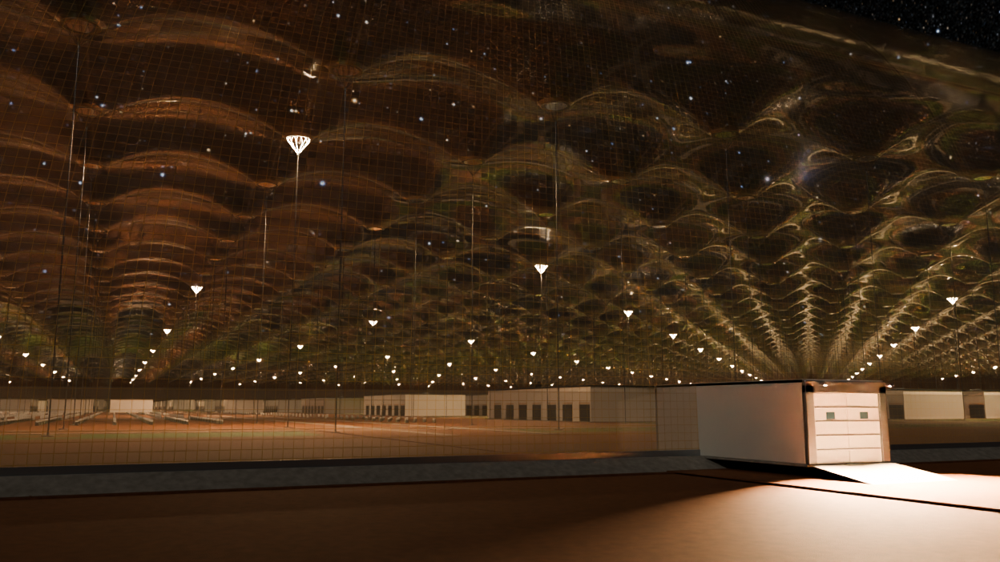

## Tools

Run these with ordinary Python from the repository folder; they drive a background Blender and never overwrite the input:

```
python tools/vault.py inspect --output renders/report.json
python tools/vault.py preview --camera 02 --night --output renders/park-night.png
python tools/vault.py variant --settings my-look.json --output renders/my-look.blend
```

See [docs/SCENE-TOOLS.md](docs/SCENE-TOOLS.md). `tools/render_previews.py` re-renders the images above. `tools/legacy/` holds the one-time scripts that built this file (the `photoreal_*` scripts are the latest pass, listed in order in `docs/CONTROLS.md`); they are kept for reference and are not meant to be rerun on the finished file.

## Credits and caveats

See [ASSET-CREDITS.md](ASSET-CREDITS.md). This is a concept visualization, not a validated pressure structure or landing-site design. Building designs, airlocks and landing clearances are schematic. Lighting and sky are art-directed approximations, not radiometric calibrations or an ephemeris.
